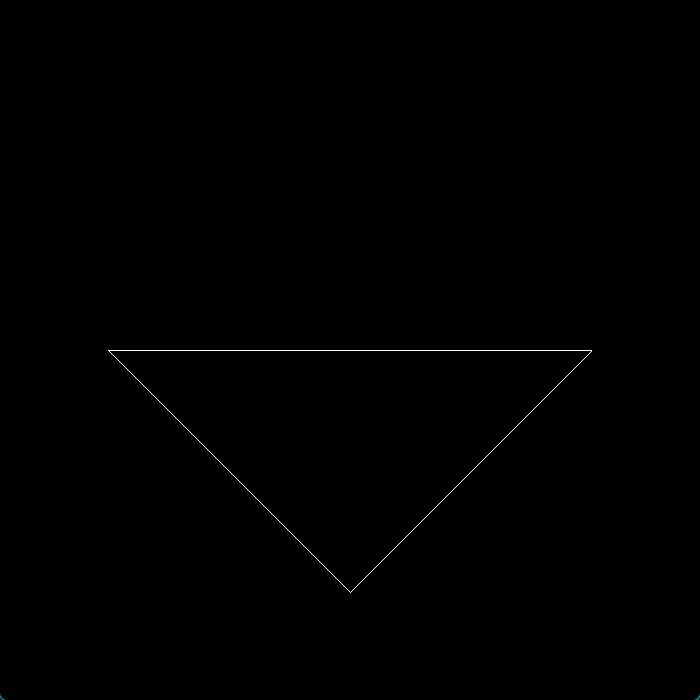
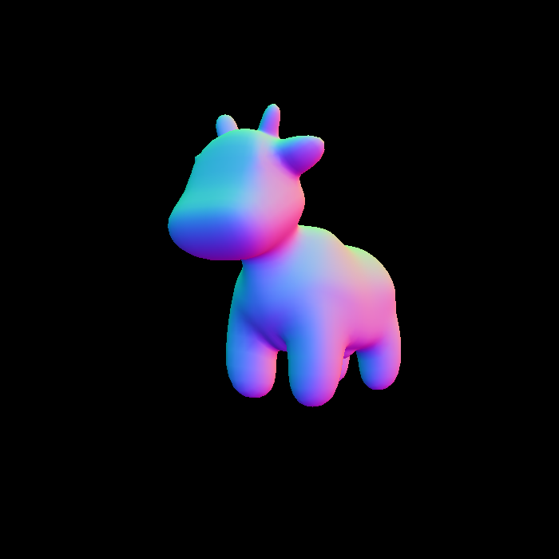
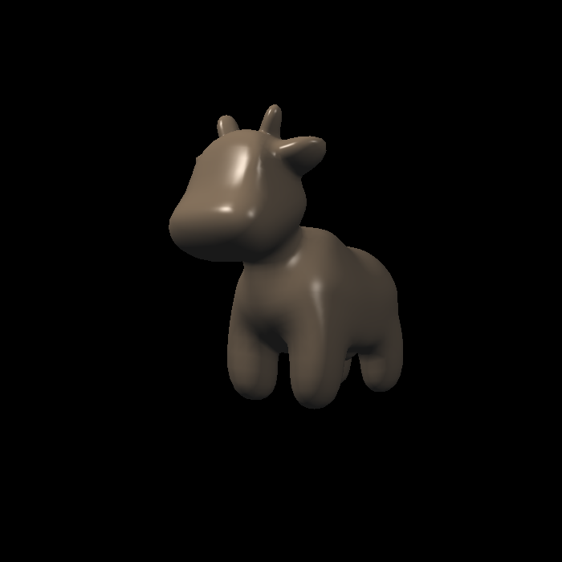
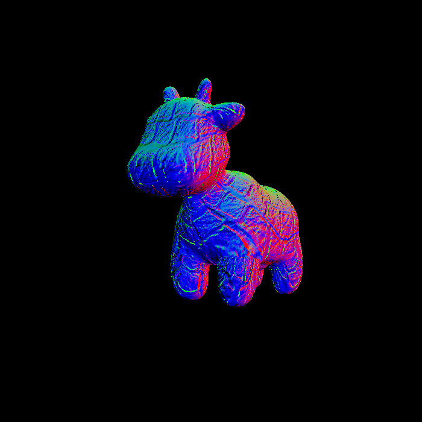
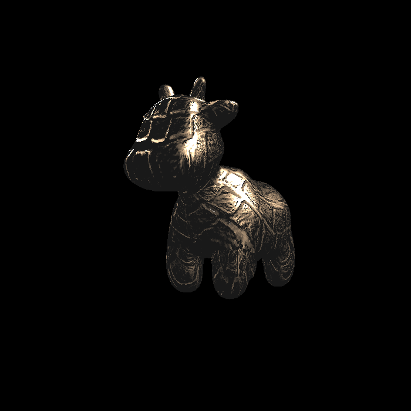
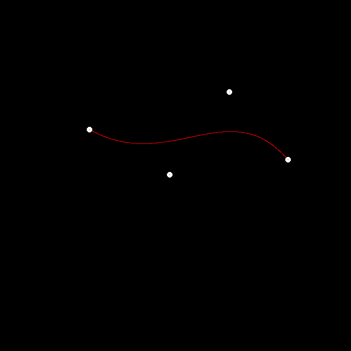
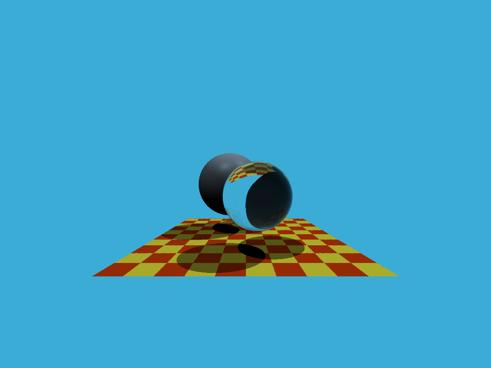
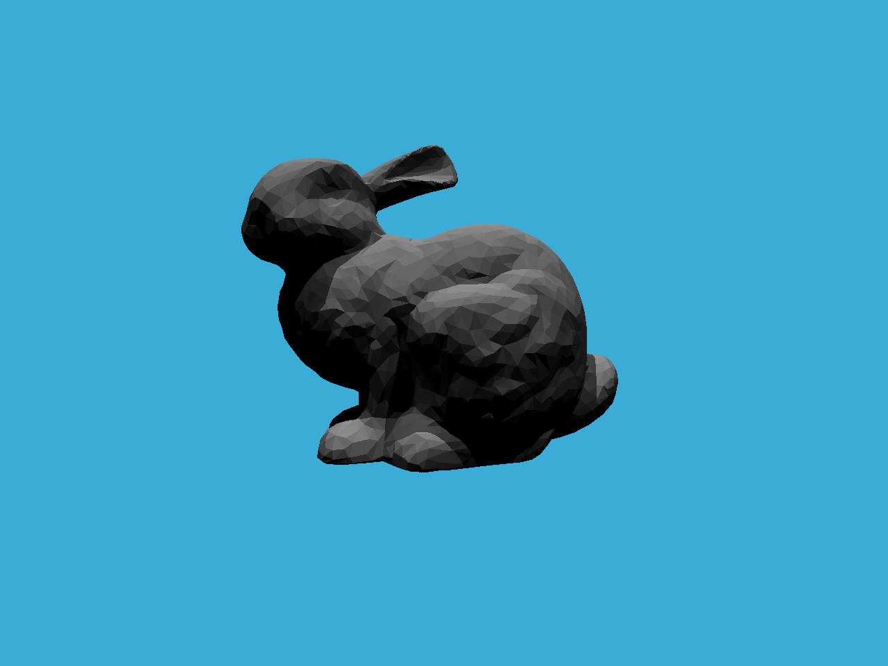
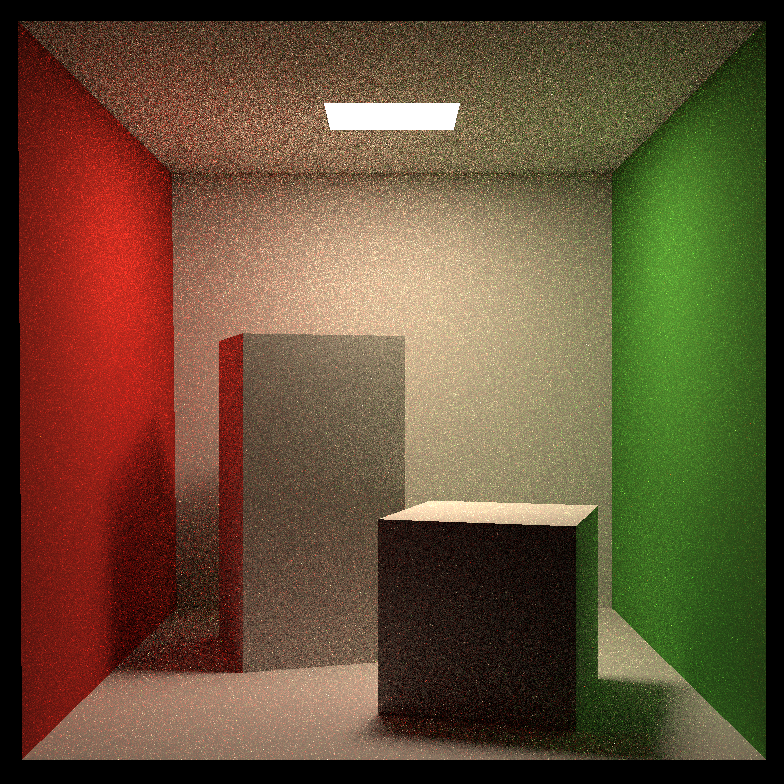
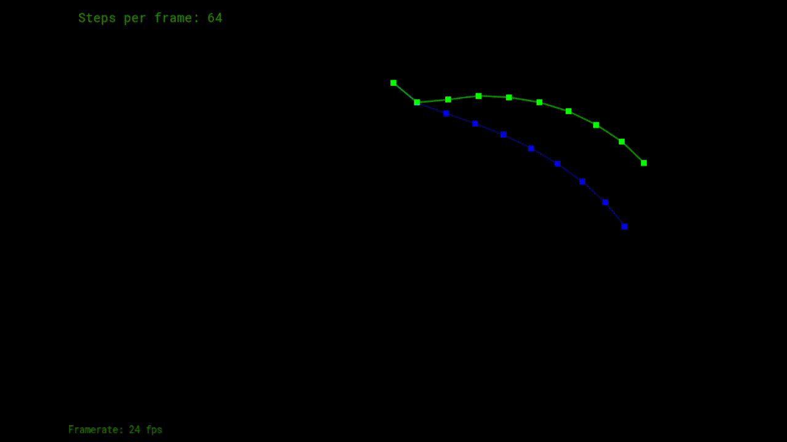

## Games101 作业

## 示例结果：  
### 作业0：  
无可显示图片

### 作业1：  

### 作业2：  
>> 作业2显示的结果可能上下颠倒，这是正常的现象，相关讨论可以参考 [作业2：结果上下颠倒](https://games-cn.org/forums/topic/zuoye2jieguoshangxiadiandao/)  

### 作业3：  
>> 作业3显示的结果可能也是上下颠倒的，原因跟作业2相同，相关讨论也可以参考[作业2：结果上下颠倒](https://games-cn.org/forums/topic/zuoye2jieguoshangxiadiandao/)  

* 法向模型  
  
* Blinn-Phong模型  
  
* 纹理模型  
  
* 凹凸贴图模型
  
* 位移贴图  
  

### 作业4：  
  

### 作业5：  
  

### 作业6：  
  

### 作业7：  
  

### 作业8：  
  